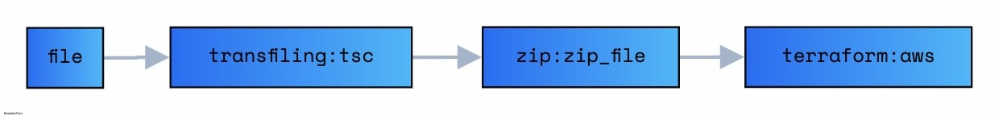

# Node + Lambda + Terraform Template

## Todo

- [ ] 만약? Lambda 함수가 100개가 각각 관리되야 한다면?
- [ ] Terraform State 관리

## Desc

- [x] Terraform
- [x] Lambda
- [ ] Cloud-watch
- [ ] Kinesis
- [ ] SNS
- [ ] SQS
- [ ] Aurora-Serverless
- [ ] API-Gateway

<!-- - [ ] AWS CodePipeline
- [ ] AWS CloudFormation
- [ ] AWS CodeBuild -->

## Deploy Process



## Process

```
    npm run zip-test

    cd infra/dev or infra.prod
    make plan
    make apply
```

## Folder

> common

    - 공통 모듈을 관리하는 폴더입니다

> src

    - labmda 함수가 위치하는 폴더입니다.

> infra

    - Terraform File 입니다

## Reference

- https://registry.terraform.io/providers/hashicorp/aws/latest/docs/resources/lambda_function
