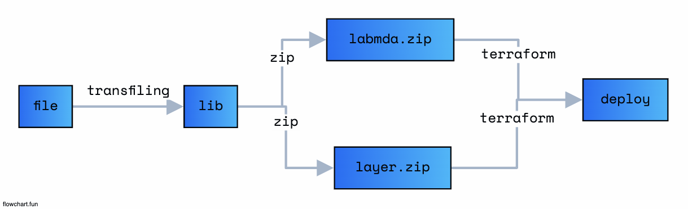

# Node + Lambda + Terraform Template

## 사용방법



```
    // 얼라이어스 적용
    source alias.sh

    // js로 빌드
    npm run cli:start

    // 2. setting infra
    cd infra/dev or cd infra/prod
    tf workspace new hello or tf workspace select hello
    tf workspace show

    // 3. apply infra
    tf init
    tf plan
    tf apply

    // 4. destroy
    tf destroy

```

## Desc

- 함수의 종속성 (node_modules)는 layer에 적용됩니다.
- rollup이나 webpack으로 Bundling 하여 업로드하는 방식은 추후 진행하도록 하겠습니다.

## Folder

> common

    - 공통 모듈을 관리하는 폴더입니다

> src

    - labmda 함수가 위치하는 폴더입니다.

> infra

    - Terraform File 입니다

## Reference

- https://registry.terraform.io/providers/hashicorp/aws/latest/docs/resources/lambda_function
